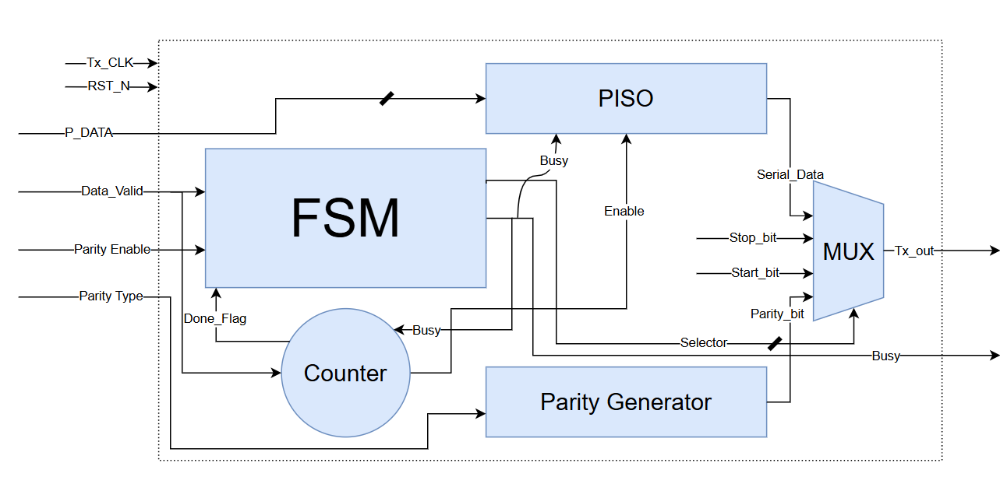
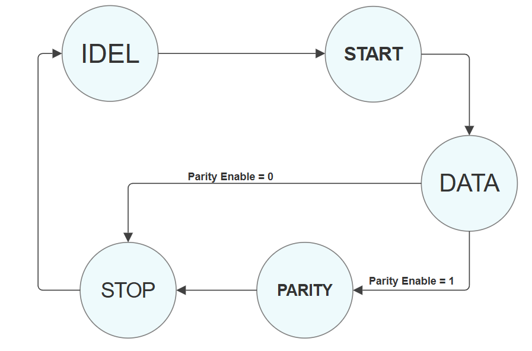
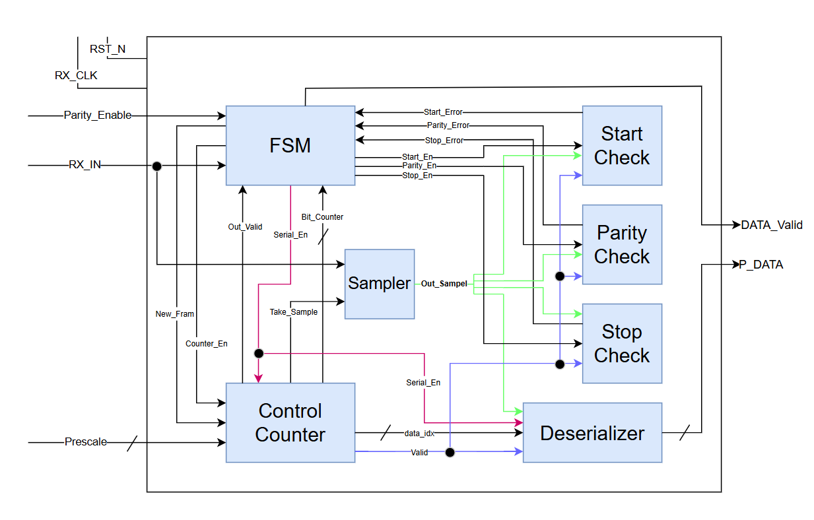

<!-- HTML README for UART Design -->

  <h1 style="margin:0; font-size:6rem;">Universal Asynchronous Receiver and Transmitter (UART) </h1>

  

    📑 Table of Contents
  

  <ul style="list-style:none; padding:0; margin:12px 0; line-height:2.2;">
    <li><a href="#overview" class="toc-link">Overview</a></li>
    <li><a href="#interface" class="toc-link">Top Interface</a></li>
    <li><a href="#Architecture of UART Transmitter" class="toc-link">Architecture of UART Transmitter</a></li>
    <li><a href="#Architecture of UART Reciver" class="toc-link">Architecture of UART Reciver</a></li>
  </ul>

<h2 id="overview">Overview</h2>

The Universal Asynchronous Receiver and Transmitter (UART) are described, which is essentially a serial data transfer protocol used in digital circuit applications. The UART transmitter architecture has a baud rate generator, a parity generator, a transmitter finite state machine (FSM), and a parallel in serial out (PISO) register. The UART receiver is composed of a baud rate generator, a negative edge detector, a parity checker, a receiver Finite State Machine (FSM), and a serial in parallel out (SIPO) register. The transmitter and the receiver have the same baud rate generator; therefore, the transmitter/receiver baud rate is the same. The baud rate generator is the same as the frequency divider circuit. A UART transmitter data frame has 1 start bit, 8 transmit data bits, 1 parity bit, and 1 stop bit..

<h2 id="features">Features</h2>
<ul>
  <li>Simple, easy-to-use UART with small logic utilization.</li>
  <li>Supports an optional parity bit (even or odd parity for transmit and
receive).</li>
  <li>1 stop bit.</li>
  <li>Baud prescaler (set according to system clock).</li>
  <li>Supports run-time configurable baud rate.</li>
  <li>Self-checking testbench with directed tests and error injection.</li>

</ul>
<h2 id="interface">Top-Level Interface</h2>

The The UART controller consists of a UART transmitter finite state machine
(FSM), UART receiver FSM, and a baud rate generator..

<table align="center";style="width:100%; border-collapse:collapse;">
  <thead>
    <tr style="background:#A2f202;">
      <th style="border:1px solid #ddd; padding:8px; text-align:left;">Signal Name</th>
      <th style="border:1px solid #ddd; padding:8px; text-align:left;">Direction</th>
      <th style="border:1px solid #ddd; padding:8px; text-align:left;">Width</th>
      <th style="border:1px solid #ddd; padding:8px; text-align:left;">Description</th>
    </tr>
  </thead>
  <tbody>
    <tr>
      <td style="border:1px solid #ddd; padding:8px;"><strong>Tx_Data</strong></td>
      <td style="border:1px solid #ddd; padding:8px;">Input</td>
      <td style="border:1px solid #ddd; padding:8px;">8-bit</td>
      <td style="border:1px solid #ddd; padding:8px;">Parallel data input to be transmitted</td>
    </tr>
    <tr>
      <td style="border:1px solid #ddd; padding:8px;"><strong>Tx_Data_Valid</strong></td>
      <td style="border:1px solid #ddd; padding:8px;">Input</td>
      <td style="border:1px solid #ddd; padding:8px;">1-bit</td>
      <td style="border:1px solid #ddd; padding:8px;">Control signal to start transmission</td>
    </tr>
    <tr>
      <td style="border:1px solid #ddd; padding:8px;">Tx_Busy</td>
      <td style="border:1px solid #ddd; padding:8px;">Output</td>
      <td style="border:1px solid #ddd; padding:8px;">1-bit</td>
      <td style="border:1px solid #ddd; padding:8px;">Indicates the transmitter is busy</td>
    </tr>
    <tr>
      <td style="border:1px solid #ddd; padding:8px;">Tx_Data_Out</td>
      <td style="border:1px solid #ddd; padding:8px;">Output</td>
      <td style="border:1px solid #ddd; padding:8px;">1-bit</td>
      <td style="border:1px solid #ddd; padding:8px;">Serial transmitted data (UART TX line)</td>
    </tr>
    <tr>
      <td style="border:1px solid #ddd; padding:8px;">Rx_Data_IN</td>
      <td style="border:1px solid #ddd; padding:8px;">Input</td>
      <td style="border:1px solid #ddd; padding:8px;">1-bit</td>
      <td style="border:1px solid #ddd; padding:8px;">Serial input data (UART RX line)</td>
    </tr>
    <tr>
      <td style="border:1px solid #ddd; padding:8px;"><strong>Rx_Data_OUT</strong></td>
      <td style="border:1px solid #ddd; padding:8px;">Output</td>
      <td style="border:1px solid #ddd; padding:8px;">8-bit</td>
      <td style="border:1px solid #ddd; padding:8px;">Parallel received data output</td>
    </tr>
    <tr>
      <td style="border:1px solid #ddd; padding:8px;">Rx_Data_Valid</td>
      <td style="border:1px solid #ddd; padding:8px;">Output</td>
      <td style="border:1px solid #ddd; padding:8px;">1-bit</td>
      <td style="border:1px solid #ddd; padding:8px;">Indicates a valid received byte</td>
    </tr>
    <tr>
      <td style="border:1px solid #ddd; padding:8px;">Clock</td>
      <td style="border:1px solid #ddd; padding:8px;">Input</td>
      <td style="border:1px solid #ddd; padding:8px;">1-bit</td>
      <td style="border:1px solid #ddd; padding:8px;">System clock</td>
    </tr>
    <tr>
      <td style="border:1px solid #ddd; padding:8px;">Reset</td>
      <td style="border:1px solid #ddd; padding:8px;">Input</td>
      <td style="border:1px solid #ddd; padding:8px;">1-bit</td>
      <td style="border:1px solid #ddd; padding:8px;">Asynchronous active-low reset</td>
    </tr>
    <tr>
      <td style="border:1px solid #ddd; padding:8px;">Prescale</td>
      <td style="border:1px solid #ddd; padding:8px;">Input</td>
      <td style="border:1px solid #ddd; padding:8px;">6-bit</td>
      <td style="border:1px solid #ddd; padding:8px;">Prescaler value for baud-rate generator</td>
    </tr>
    <tr>
      <td style="border:1px solid #ddd; padding:8px;">Parity_Enable</td>
      <td style="border:1px solid #ddd; padding:8px;">Input</td>
      <td style="border:1px solid #ddd; padding:8px;">1-bit</td>
      <td style="border:1px solid #ddd; padding:8px;">Enable parity generation/checking</td>
    </tr>
    <tr>
      <td style="border:1px solid #ddd; padding:8px;">Parity_Type</td>
      <td style="border:1px solid #ddd; padding:8px;">Input</td>
      <td style="border:1px solid #ddd; padding:8px;">1-bit</td>
      <td style="border:1px solid #ddd; padding:8px;">0 = even, 1 = odd (example mapping)</td>
    </tr>
    <tr>
      <td style="border:1px solid #ddd; padding:8px;">Frame_Err</td>
      <td style="border:1px solid #ddd; padding:8px;">Output</td>
      <td style="border:1px solid #ddd; padding:8px;">1-bit</td>
      <td style="border:1px solid #ddd; padding:8px;">Indicates stop-bit/frame error</td>
    </tr>
    <tr>
      <td style="border:1px solid #ddd; padding:8px;">Parity_Err</td>
      <td style="border:1px solid #ddd; padding:8px;">Output</td>
      <td style="border:1px solid #ddd; padding:8px;">1-bit</td>
      <td style="border:1px solid #ddd; padding:8px;">Parity mismatch detected</td>
    </tr>
  </tbody>
</table>

  

<h1 id="Architecture of UART Transmitter">Architecture of UART Transmitter</h1>

The <strong>UART Transmitter</strong> is composed of <strong>six main modules</strong> that cooperate to convert parallel data into a UART-formatted serial stream. The transmitter accepts an 8-bit parallel input (<code>P_Data</code>) together with control signals (data valid, parity enable/type). It serializes the data, optionally appends a parity bit, and sends the formatted frame out on <code>Tx_OUT</code>.

<figure style="text-align:center; margin:20px 0;">
  
  <figcaption style="font-size:14px; color:#555; margin-top:8px;">
    Figure 2: UART Transmitter Block Diagram
  </figcaption>
</figure>
<h2>UART frame format</h2>
<pre class="frame">Start (0) &rarr; Data bits (8, LSB first) &rarr; Parity (optional) &rarr; Stop (1)</pre>

<h2 class="modules">Modules description</h2>

<h3>1. FSM of Transmitter</h3>

<strong>Role:</strong> The UART_FSM_Tx module implements a finite state machine to control the UART transmission sequence, transitioning through states: IDLE, START, DATA, PARITY (optional), STOP, and back to IDLE, based on input signals like Data_Valid, Parity_Enable, and Done_Flag. In IDLE, it waits for data, then moves to START to send the start bit, followed by DATA for the 8 data bits, optionally proceeds to PARITY if enabled, and finally sends the STOP bit before returning to IDLE. The module uses state encoding with a 5-bit register, with combinational logic dictating next state transitions and output signals—Busy and Selector—that indicate transmission status and select the appropriate data bit or control signal for the multiplexer driving the UART transmission line. The design ensures synchronized control over UART data flow, managing the timing and sequence of bits in a reliable manner..

<figure style="text-align:center; margin:20px 0;">
  
  <figcaption style="font-size:14px; color:#555; margin-top:8px;">
    Figure 3: UART Transmitter State Machine
  </figcaption>
</figure>

<h3>2. Counter Control</h3>

<strong>Role:The Counter Control module manages a 3-bit counter synchronized with the system clock to facilitate UART data transmission, providing control signals for the serializer. It begins with an asynchronous active-low reset that initializes the counter and control flags. When the FSM indicates that data transmission is active (Busy is high), and the transmission isn't complete (Done_Flag is low), the counter increments each clock cycle, and a one-cycle Enable pulse is generated to trigger the serializer to shift out the next bit. The Done_Flag goes high when the counter reaches 7, indicating that all eight bits have been transmitted. When the transmission ends (Busy goes low), the counter and flags reset, preparing the module for the next transmission cycle. This design ensures precise timing and control over UART bit transmission, coordinating the shift pulses with the FSM's state and data flow.

<h3>3. Parity_Tx</h3>

<strong>Role:The Parity module generates an appropriate parity bit for an 8-bit data input based on the specified parity type—either even or odd—using combinational logic. It calculates the XOR of all data bits (^P_Data) to determine the current parity of the data. If Parity_Ty is 0 (even parity), the module sets Par_bit to 0 when data already has even parity, or 1 to make it even if it’s odd. Conversely, if Parity_Ty is 1 (odd parity), Par_bit is set to ensure the total number of ones becomes odd, with logic inverted accordingly. This approach efficiently produces the required parity bit, enabling error detection during UART transmission.

<h3>4. Serializer_Tx</h3>

<strong>Role:The SIPO module functions as an 8-bit serial transmitter that loads parallel data into a shift register when 'Data_Valid' is asserted and the transmitter is idle ('!Busy'). When the 'Enable' signal pulses, it shifts the register right by one bit each clock cycle, outputting the least significant bit ('Shift_Reg[0]') as 'Serial_Data'. The register is asynchronously cleared during reset ('RST'), ensuring a known starting state. This setup facilitates sequential serial transmission, suitable for protocols like UART, with synchronized data loading and shifting controlled by the input signals.

<h1 id="Architecture of UART Reciver">Architecture of UART Reciver</h1>

The UART RX top module serves as the main integration point for the receiver path of a Universal Asynchronous Receiver‑Transmitter system. It coordinates the flow of serial data coming from the input line, manages timing and bit sampling, and ensures error‑free delivery of valid data bytes to the system. The design adopts a modular approach where the control logic, datapath, and error handling are distributed into dedicated submodules that the top module interconnects.

The top‑level UART RX is composed of three essential blocks:

<ul>
<li><strong>Finite State Machine (FSM)</strong> — Supervises the reception sequence by progressing through IDLE, START, DATA, PARITY, and STOP phases. It activates control signals for sampling, counting, and error checking.</li>
<li><strong>Datapath</strong> — Handles the actual shifting and storage of incoming serial bits into parallel form, as well as generating status signals to the FSM.</li>
<li><strong>Error Detection Units</strong> — Dedicated logic to validate start, parity, and stop conditions, ensuring corrupted frames are discarded.</li>
</ul>

The top module connects these submodules and distributes signals such as counters, enables, error flags, and data validity markers.

<figure style="text-align:center; margin:20px 0;">
  
  <figcaption style="font-size:14px; color:#555; margin-top:8px;">
    Figure 4: UART Reciver Block Diagram
  </figcaption>
</figure>

<h2 class="modules">Modules description</h2>

<h3>1) FSM States</h3>

The FSM uses one‑hot encoding with five states:

<ul>
<li><strong>IDLE</strong> — Wait for <code>RX_IN</code> to go low; on detection, raise <code>Counter_En</code>, <code>Start_En</code>, <code>New_Fram</code>, then go to <strong>START</strong>.</li>
<li><strong>START</strong> — Validate start bit using <code>Out_Valid</code> and <code>Bit_Counter==1</code>. If <code>Start_error</code> return to <strong>IDLE</strong>, else proceed to <strong>DATA</strong>.</li>
<li><strong>DATA</strong> — Enable serial sampling (<code>Serial_En</code>) and counting; at <code>Bit_Counter==9</code> go to <strong>PARITY</strong> if <code>PAR_EN</code> else to <strong>STOP</strong>.</li>
<li><strong>PARITY</strong> — Check parity (<code>Parity_En</code>); if <code>Parity_error</code> return to <strong>IDLE</strong>, else at <code>Bit_Counter==10</code> go to <strong>STOP</strong>.</li>
<li><strong>STOP</strong> — Validate stop bit (<code>Stop_En</code>). On success assert <code>DATA_VLD</code>; if <code>~RX_IN</code> is seen immediately, start a new frame; on <code>Stop_error</code> return to <strong>IDLE</strong>.</li>
</ul>
<figure style="text-align:center; margin:20px 0;">
  
  <figcaption style="font-size:14px; color:#555; margin-top:8px;">
    Figure 5: UART Reciver State Machine
  </figcaption>
</figure>

<section id="working">
<h4>a) Working Principle</h4>
<ol>
<li><strong>Frame Detection</strong> — Falling edge on <code>RX_IN</code> triggers start detection in <strong>IDLE</strong>.</li>
<li><strong>Start Validation</strong> — Qualified by <code>Out_Valid</code> &amp; <code>Bit_Counter==1</code>; invalid start returns to <strong>IDLE</strong>.</li>
<li><strong>Data Reception</strong> — Eight data bits sampled in <strong>DATA</strong> with <code>Serial_En</code> asserted.</li>
<li><strong>Optional Parity</strong> — If <code>PAR_EN</code> is high, check parity in <strong>PARITY</strong>.</li>
<li><strong>Stop Validation</strong> — Stop bit checked in <strong>STOP</strong>; on success, assert <code>DATA_VLD</code> for one cycle.</li>
</ol>
</section>

<section id="errors">
<h4>b) Error Handling</h4>
<ul>
<li>Start_error → Return to <strong>IDLE</strong>.</li>
<li>Parity_error → Return to <strong>IDLE</strong>.</li>
<li>Stop_error → Return to <strong>IDLE</strong>.</li>
</ul>
</section>

<h3>2) Counter Module</h3>

The Counter module in the UART RX system is responsible for tracking the number of clock cycles and bit positions during the reception process. It ensures proper synchronization with incoming serial data and provides timing references to other modules such as the FSM, deserializer, and error detection logic.

<h4>a) Internal Functionality</h4>

The counter increments in response to the system clock whenever enabled by the FSM. Each count value corresponds to a specific phase in the reception of a frame:

<ul>
<li><strong>Start Bit Phase:</strong> Ensures the start bit is sampled correctly.</li>
<li><strong>Data Bit Phase:</strong> Tracks each of the data bits being shifted into the deserializer.</li>
<li><strong>Parity Phase:</strong> Aligns parity checking when enabled.</li>
<li><strong>Stop Phase:</strong> Validates the stop bit and signals the end of frame reception.</li>
</ul>

<h4>b) Working Principle</h4>
<ul>
<li>Provides precise timing control for data sampling.</li>
<li>Coordinates multiple phases of UART reception.</li>
<li>Ensures synchronization with the serial input line.</li>
<li>Resets at the end of each frame or when errors occur.</li>
</ul>

<h4>c) Interaction with Other Modules</h4>

The Counter works closely with the FSM, which controls when counting starts and resets. Its outputs (bit position and validity signals) are used by the deserializer to know when to sample bits, and by the error detection logic to determine if the start, parity, or stop bits were correctly received.

<h3>3) Deserializer Module</h3>
  

    The <b>Deserializer</b> module converts incoming serial data into parallel form. 
    This is essential in UART-like systems where data arrives bit by bit but needs 
    to be reconstructed into complete data words for processing.
  

 <h4>a) Functionality</h4>
  <ul>
    <li>Shifts incoming serial bits into a shift register on each clock pulse.</li>
    <li>Accumulates the bits until a full word (e.g., 8 bits) is received.</li>
    <li>Generates a <b>data valid</b> signal once the entire word is reconstructed.</li>
    <li>Interfaces with the Counter to ensure correct timing for sampling bits.</li>
  </ul>

  <h4>b) Role in System</h4>
  

    It works in 
    conjunction with the Counter to correctly align incoming bits and assemble them 
    into parallel format. Once data is ready, it can be passed to higher-level 
    processing units.
  

<h3>4) Sampler Module</h3>
  

    The <b>Sampler</b> module ensures that incoming serial data is captured 
    at the correct timing. In UART-based systems, data must be sampled at 
    precise intervals to avoid errors caused by jitter, noise, or clock 
    mismatches.
  

 <h4>a) Functionality</h4>
  <ul>
    <li>Receives the serial input signal and samples it based on a 
        reference clock derived from the baud rate.</li>
    <li>Implements <b>mid-bit sampling</b> to improve accuracy in 
        detecting each bit.</li>
    <li>Reduces sensitivity to glitches and noise by filtering or 
        oversampling techniques.</li>
    <li>Provides stable sampled data to the Deserializer for further 
        processing.</li>
  </ul>
  <h4>b) Role in System</h4>
  

    The Sampler guarantees reliable data reception by ensuring that each bit 
    of the incoming stream is captured at its most stable point. This sampled 
    data is then passed into the Deserializer, where it is shifted and 
    accumulated into parallel form.
  

   <h3>5) Error Detection Module</h3>
  

    The <b>Error Detection</b> block is responsible for identifying invalid 
    conditions that may occur during serial data reception. Grouping all 
    error detectors into a single block simplifies the design and provides 
    a centralized status interface for the system.
  

  <h4>a) Types of Errors Detected</h4>
  <ul>
    <li><b>Parity Error:</b> Triggered when the calculated parity of the received 
        data does not match the expected parity bit.</li>
    <li><b>Framing Error:</b> Detected when the stop bit is missing or incorrect, 
        usually due to timing mismatches or line noise.</li>
    <li><b>Start Bit Error:</b> Raised if the start bit is invalid (not held low 
        for the required sampling duration).</li>
    <li><b>Overrun Error:</b> Occurs if new data arrives before the previous data 
        word has been processed or cleared.</li>
  </ul>

  <h4>b) Role in System</h4>
  

    The Error Detection module provides feedback signals that indicate 
    reception problems. These flags are used by the control logic (FSM) or 
    higher-level layers to handle faults, request retransmissions, or 
    discard corrupted frames.
  

