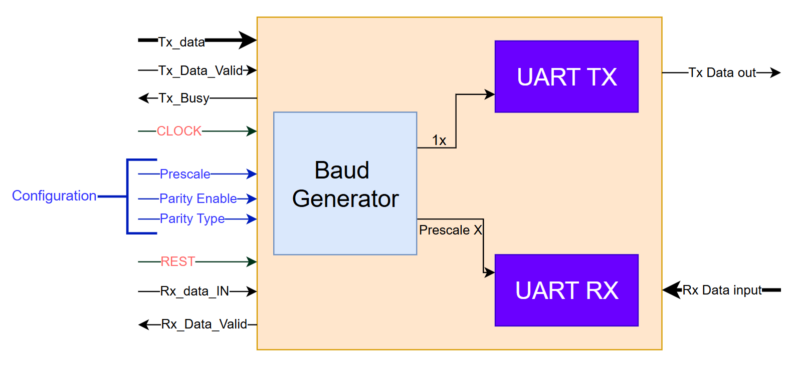

<!-- HTML README for UART Design -->

  <h1 style="margin:0; font-size:6rem;">Universal Asynchronous Receiver and Transmitter (UART) </h1>

  

    📑 Table of Contents
  

  <ul style="list-style:none; padding:0; margin:12px 0; line-height:2.2;">
    <li><a href="#overview" class="toc-link">Overview</a></li>
    <li><a href="#interface" class="toc-link">Top Interface</a></li>
    <li><a href="#Architecture of UART Transmitter" class="toc-link">Architecture of UART Transmitter</a></li>
    <li><a href="#usage" class="toc-link">Usage</a></li>
    <li><a href="#diagram" class="toc-link">Block Diagram</a></li>
  </ul>

<h2 id="overview">Overview</h2>

The Universal Asynchronous Receiver and Transmitter (UART) are described, which is essentially a serial data transfer protocol used in digital circuit applications. The UART transmitter architecture has a baud rate generator, a parity generator, a transmitter finite state machine (FSM), and a parallel in serial out (PISO) register. The UART receiver is composed of a baud rate generator, a negative edge detector, a parity checker, a receiver Finite State Machine (FSM), and a serial in parallel out (SIPO) register. The transmitter and the receiver have the same baud rate generator; therefore, the transmitter/receiver baud rate is the same. The baud rate generator is the same as the frequency divider circuit. A UART transmitter data frame has 1 start bit, 8 transmit data bits, 1 parity bit, and 1 stop bit..

<h2 id="features">Features</h2>
<ul>
  <li>Simple, easy-to-use UART with small logic utilization.</li>
  <li>Supports an optional parity bit (even or odd parity for transmit and
receive).</li>
  <li>1 stop bit.</li>
  <li>Baud prescaler (set according to system clock).</li>
  <li>Supports run-time configurable baud rate.</li>
  <li>Self-checking testbench with directed tests and error injection.</li>

</ul>
<h2 id="interface">Top-Level Interface</h2>

The The UART controller consists of a UART transmitter finite state machine
(FSM), UART receiver FSM, and a baud rate generator..

<table align="center";style="width:100%; border-collapse:collapse;">
  <thead>
    <tr style="background:#A2f202;">
      <th style="border:1px solid #ddd; padding:8px; text-align:left;">Signal Name</th>
      <th style="border:1px solid #ddd; padding:8px; text-align:left;">Direction</th>
      <th style="border:1px solid #ddd; padding:8px; text-align:left;">Width</th>
      <th style="border:1px solid #ddd; padding:8px; text-align:left;">Description</th>
    </tr>
  </thead>
  <tbody>
    <tr>
      <td style="border:1px solid #ddd; padding:8px;"><strong>Tx_Data</strong></td>
      <td style="border:1px solid #ddd; padding:8px;">Input</td>
      <td style="border:1px solid #ddd; padding:8px;">8-bit</td>
      <td style="border:1px solid #ddd; padding:8px;">Parallel data input to be transmitted</td>
    </tr>
    <tr>
      <td style="border:1px solid #ddd; padding:8px;"><strong>Tx_Data_Valid</strong></td>
      <td style="border:1px solid #ddd; padding:8px;">Input</td>
      <td style="border:1px solid #ddd; padding:8px;">1-bit</td>
      <td style="border:1px solid #ddd; padding:8px;">Control signal to start transmission</td>
    </tr>
    <tr>
      <td style="border:1px solid #ddd; padding:8px;">Tx_Busy</td>
      <td style="border:1px solid #ddd; padding:8px;">Output</td>
      <td style="border:1px solid #ddd; padding:8px;">1-bit</td>
      <td style="border:1px solid #ddd; padding:8px;">Indicates the transmitter is busy</td>
    </tr>
    <tr>
      <td style="border:1px solid #ddd; padding:8px;">Tx_Data_Out</td>
      <td style="border:1px solid #ddd; padding:8px;">Output</td>
      <td style="border:1px solid #ddd; padding:8px;">1-bit</td>
      <td style="border:1px solid #ddd; padding:8px;">Serial transmitted data (UART TX line)</td>
    </tr>
    <tr>
      <td style="border:1px solid #ddd; padding:8px;">Rx_Data_IN</td>
      <td style="border:1px solid #ddd; padding:8px;">Input</td>
      <td style="border:1px solid #ddd; padding:8px;">1-bit</td>
      <td style="border:1px solid #ddd; padding:8px;">Serial input data (UART RX line)</td>
    </tr>
    <tr>
      <td style="border:1px solid #ddd; padding:8px;"><strong>Rx_Data_OUT</strong></td>
      <td style="border:1px solid #ddd; padding:8px;">Output</td>
      <td style="border:1px solid #ddd; padding:8px;">8-bit</td>
      <td style="border:1px solid #ddd; padding:8px;">Parallel received data output</td>
    </tr>
    <tr>
      <td style="border:1px solid #ddd; padding:8px;">Rx_Data_Valid</td>
      <td style="border:1px solid #ddd; padding:8px;">Output</td>
      <td style="border:1px solid #ddd; padding:8px;">1-bit</td>
      <td style="border:1px solid #ddd; padding:8px;">Indicates a valid received byte</td>
    </tr>
    <tr>
      <td style="border:1px solid #ddd; padding:8px;">Clock</td>
      <td style="border:1px solid #ddd; padding:8px;">Input</td>
      <td style="border:1px solid #ddd; padding:8px;">1-bit</td>
      <td style="border:1px solid #ddd; padding:8px;">System clock</td>
    </tr>
    <tr>
      <td style="border:1px solid #ddd; padding:8px;">Reset</td>
      <td style="border:1px solid #ddd; padding:8px;">Input</td>
      <td style="border:1px solid #ddd; padding:8px;">1-bit</td>
      <td style="border:1px solid #ddd; padding:8px;">Asynchronous active-low reset</td>
    </tr>
    <tr>
      <td style="border:1px solid #ddd; padding:8px;">Prescale</td>
      <td style="border:1px solid #ddd; padding:8px;">Input</td>
      <td style="border:1px solid #ddd; padding:8px;">6-bit</td>
      <td style="border:1px solid #ddd; padding:8px;">Prescaler value for baud-rate generator</td>
    </tr>
    <tr>
      <td style="border:1px solid #ddd; padding:8px;">Parity_Enable</td>
      <td style="border:1px solid #ddd; padding:8px;">Input</td>
      <td style="border:1px solid #ddd; padding:8px;">1-bit</td>
      <td style="border:1px solid #ddd; padding:8px;">Enable parity generation/checking</td>
    </tr>
    <tr>
      <td style="border:1px solid #ddd; padding:8px;">Parity_Type</td>
      <td style="border:1px solid #ddd; padding:8px;">Input</td>
      <td style="border:1px solid #ddd; padding:8px;">1-bit</td>
      <td style="border:1px solid #ddd; padding:8px;">0 = even, 1 = odd (example mapping)</td>
    </tr>
    <tr>
      <td style="border:1px solid #ddd; padding:8px;">Frame_Err</td>
      <td style="border:1px solid #ddd; padding:8px;">Output</td>
      <td style="border:1px solid #ddd; padding:8px;">1-bit</td>
      <td style="border:1px solid #ddd; padding:8px;">Indicates stop-bit/frame error</td>
    </tr>
    <tr>
      <td style="border:1px solid #ddd; padding:8px;">Parity_Err</td>
      <td style="border:1px solid #ddd; padding:8px;">Output</td>
      <td style="border:1px solid #ddd; padding:8px;">1-bit</td>
      <td style="border:1px solid #ddd; padding:8px;">Parity mismatch detected</td>
    </tr>
  </tbody>
</table>

  

<h1 id="Architecture of UART Transmitter">Architecture of UART Transmitter</h1>

The <strong>UART Transmitter</strong> is composed of <strong>six main modules</strong> that cooperate to convert parallel data into a UART-formatted serial stream. The transmitter accepts an 8-bit parallel input (<code>P_Data</code>) together with control signals (data valid, parity enable/type). It serializes the data, optionally appends a parity bit, and sends the formatted frame out on <code>Tx_OUT</code>.

  

<h2>UART frame format</h2>
<pre class="frame">Start (0) &rarr; Data bits (8, LSB first) &rarr; Parity (optional) &rarr; Stop (1)</pre>

<h2 class="modules">Modules description</h2>

<h3>1. UART_Tx_Top</h3>

<strong>Role:</strong> Top-level module that instantiates and connects all submodules. It exposes the primary I/O such as system clock, P_Data, parity control signals, <code>Tx_OUT</code> and <code>Busy</code>.

<h3>2. UART_FSM_Tx</h3>

<strong>Role:</strong> The finite state machine that controls the transmission sequence. Typical states include <em>Idle</em>, <em>Start</em>, <em>Data</em>, <em>Parity</em>, and <em>Stop</em>. It produces control signals (e.g., <code>Selector</code>) used by the MUX and <code>Busy</code> to indicate an ongoing transmission.

<h3>3. Counter_Control</h3>

<strong>Role:</strong> Generates per-bit timing and counts the number of transmitted data bits. It asserts a <code>Done_Flag</code> when all 8 data bits have been shifted out and provides enables to the serializer on each bit period.

<h3>4. Parity_Tx</h3>

<strong>Role:</strong> Computes the parity bit from the 8-bit input (<code>P_Data</code>). Supports both even and odd parity selection via a control input (e.g., <code>Parity_Type</code>), and outputs a single <code>Par_bit</code> used during the parity stage.

<h3>5. Serializer_Tx</h3>

<strong>Role:</strong> Converts the parallel 8-bit word into a serial stream. When enabled by <code>Counter_Control</code>, the serializer shifts out one bit per bit-period, typically LSB first to conform with UART conventions.

<h3>6. MUX_Tx</h3>

<strong>Role:</strong> Selects which logical bit is driven to <code>Tx_OUT</code> at each stage of the frame. The MUX chooses between the constant <code>Start</code> value (0), the serializer output (data bits), the parity bit (from <code>Parity_Tx</code>), and the constant <code>Stop</code> value (1), based on a <code>Selector</code> signal from the FSM.

